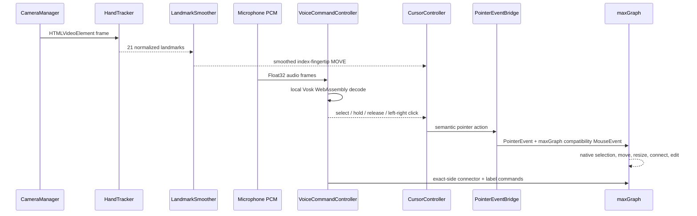

AirDrawio is built around one non-negotiable constraint: gesture-driven pointer input must reach the graph editor's real DOM. That constraint determined every major structural choice — the choice of graph engine, where state lives, how often React re-renders, and what happens when the hand disappears from frame.

## Why maxGraph instead of an iframe

The initial architecture review considered two paths. The first was to embed the hosted diagrams.net editor in a cross-origin iframe and use its official embed API to load and save diagrams. The second was to integrate the graph engine directly in the React page.

The iframe path fails at the gesture layer. Hosted diagrams.net is cross-origin, and browsers block a parent page from inspecting hit targets inside a cross-origin iframe's document or dispatching synthetic pointer events into it. The embed API is an excellent diagram exchange protocol, not an input-injection interface.

AirDrawio therefore runs **maxGraph directly in the React page**. maxGraph is the maintained TypeScript successor to mxGraph and retains the complete graph model, resize and selection handlers, connection model, text editing, undoable model transactions, and XML-compatible lineage. Keeping the graph engine same-origin places every voice and camera input target in one DOM, proves the full interaction loop, and avoids maintaining a complete draw.io application fork.

## Runtime data flow

Every camera frame produces 21 normalized hand landmarks. Every microphone buffer produces decoded voice commands. Both paths converge on `CursorController`, which decides whether to issue a move, press, or release to `PointerEventBridge`. The bridge converts that semantic action into real `PointerEvent` and `MouseEvent` objects dispatched on the element under the cursor, which maxGraph handles as native user input.

`PointerEventBridge` emits both `PointerEvent` and a matching `MouseEvent` after each action because maxGraph's internal interaction stack still consumes mouse events in parts of its pipeline. The gesture layer itself remains pointer-event-first; the compatibility events are a downstream concern.

## High-frequency data flow

Landmarks and cursor position are processed every animation frame inside controller objects and React refs. React state is updated at a **lower cadence of approximately 110 ms** — enough for the status UI to feel responsive to humans, but not on every camera frame. This keeps the main React component stable at runtime and avoids re-rendering `MaxGraphCanvas`, `GestureToolbar`, and `SettingsPanel` dozens of times per second.

The tracking loop runs in a `requestAnimationFrame` callback. When a valid hand frame arrives with sufficient confidence, it:

1. Runs `LandmarkSmoother.update()` on the raw index fingertip landmark.
2. Calls `CoordinateMapper.map()` to convert the normalized point to viewport pixels.
3. Applies a 1.5 px dead zone to remove sub-pixel tremor.
4. Passes the resulting `PointerPosition` to `CursorController.voiceMove()` or to `GestureEngine.update()` when pinch fallback is active.
5. After 110 ms, writes the snapshot to React state for the status and debug panels.

## Cleanup and failure behavior

Switching from Gesture Mode to Mouse Mode runs a full synchronous teardown in `stopGestureMode`:

- Cancels the `requestAnimationFrame` loop
- Calls `GestureEngine.handLost()` to emit any outstanding `HAND_LOST` transition and release pointer state
- Calls `HandTracker.close()` to shut down the MediaPipe task
- Stops all camera and microphone media tracks
- Stops the local Vosk voice recognizer and tears down the microphone `AudioContext`
- Clears the skeleton preview canvas
- Resets `LandmarkSmoother` and `ZoomGestureDetector`
- Resets `ThumbDrawDetector` and discards any in-progress air stroke
- Clears the anchor marker, zoom mode state, and pointer position

**Hand disappearance** is handled separately from a manual mode switch. If a confident hand frame has not arrived for more than **180 ms**, the tracking loop fires a single `HAND_LOST` transition. `GestureStateMachine.handLost()` returns a forced `pointerup` event so maxGraph cannot remain stuck in a drag with no pointer to release it.

## Future compatibility

Two explicit seams exist for future extension:

- **`DrawioBridge`** is an interface that separates UI actions from the current `DrawioController` implementation. A future full diagrams.net fork can implement the same interface, and the voice and gesture layers require no changes.
- **`DiagramRefiner`** is an intentionally empty interface boundary — `refine(diagram)` is declared but not implemented — reserved for AI-assisted layout suggestions.
