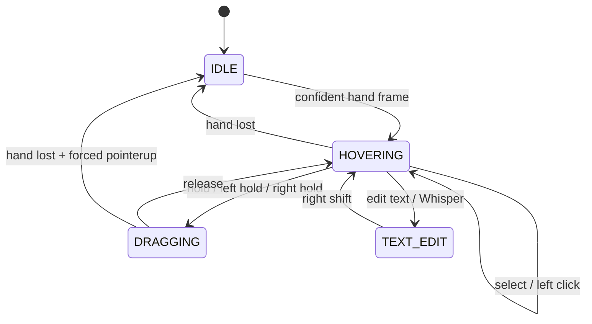

AirDrawio separates the two hardest problems in hands-free input: fast spatial targeting and reliable discrete actions. The hand is a pointing device; speech is a button. This division lets users position the cursor precisely without triggering accidental drags, and lets voice commands fire instantly without any spatial gesture to resolve.

## Camera position, voice action

The index fingertip maps continuously to pointer motion. Speech supplies the discrete button actions — click, hold, release, right-click. Keeping those concerns separate has practical consequences:

- Spatial targeting is as fast and precise as the user's steady hand.
- There is no pose to maintain during a drag — say "hold," move your finger, say "release."
- Unintentional pinch-like postures during natural hand motion do not trigger diagram operations.

Voice commands are enabled and pinch actions are disabled by default. Pinch fallback is an opt-in that adds camera-only clicking on top of the voice layer.

## State machine

The interaction state machine governs which pointer operations are permitted at each moment. It transitions on confident hand frames, voice commands, and the passage of time.



`GestureStateMachine` manages the IDLE, HOVERING, PINCHED, and DRAGGING states for pinch-fallback interactions. The `CursorController` reflects the logical DRAGGING and TEXT_EDIT states to the virtual cursor CSS classes and to the React status panel at the lower update cadence.

## Landmark smoothing

Raw MediaPipe landmark positions contain per-frame noise that produces visible cursor jitter. `LandmarkSmoother` applies a velocity-sensitive exponential moving average:

```
smoothed = alpha × current + (1 - alpha) × previous
```

The alpha value adapts to motion speed:

- **Slow motion** → lower alpha → heavier damping → precision at the cost of a small lag.
- **Fast motion** → higher alpha → less damping → follows the hand without trailing behind.

The `slowAlpha` default is **0.2**. `fastAlpha` is computed as `min(0.78, max(0.48, smoothing × 2.5))` where `smoothing` is the settings slider value, also defaulting to 0.2. A configurable `velocityThreshold` (default 0.065 normalized units) determines where the blend is fully fast.

After coordinate mapping, a **1.5 px screen-space dead zone** removes sub-pixel tremor. If the new position is within 1.5 px of the previous mapped position, the previous position is kept.

## Orientation-independent pinch ratio

MediaPipe provides both projected image landmarks (2D, normalized 0–1) and 3D world landmarks that include metric z-depth. The pinch detector prefers the 3D set so that turning the hand sideways — where the thumb and index finger may appear closer together in projection — does not produce a false pinch.

The ratio is normalized by the longest stable palm span to remain scale-independent as the hand moves toward or away from the camera:

```
pinchRatio = distance(thumbTip, indexTip)
             --------------------------------
             max(
               distance(indexMCP, pinkyMCP),
               distance(wrist, middleMCP),
               distance(wrist, indexMCP),
               distance(wrist, pinkyMCP)
             )
```

World-landmark distance includes x, y, and z components. If world landmarks are unavailable, the same robust multi-span palm normalization is applied in projected 2D. This fallback avoids the earlier failure mode where `indexMCP → pinkyMCP` collapsed to near-zero as the palm turned perpendicular to the camera.

### Default hysteresis thresholds

| Parameter | Value |
|-----------|-------|
| Start candidate | ratio < 0.46 |
| Confirm after | 55 ms |
| Release above | 0.62 |
| Cooldown after release | 90 ms |

The two thresholds prevent oscillation near the boundary. The minimum confirmation duration filters single-frame landmark spikes that would otherwise generate spurious pinch starts.

## Confidence gating and hand loss

Frames with a MediaPipe confidence score below the configured threshold (default 0.6) cannot advance the interaction — the cursor stops moving but no pointer events are emitted and no state transition occurs.

Sustained absence triggers a more decisive response. If a confident frame has not arrived for more than **180 ms**, the tracking loop fires the `HAND_LOST` transition. `GestureStateMachine.handLost()` emits a forced `HAND_LOST` event that `PointerEventBridge` converts to a `pointerup`, ensuring maxGraph is never left in a drag with no pointer to release it. The smoother and zoom detector are also reset.

## Double pinch

A completed pinch followed by a new pinch start within the configured interval emits `DOUBLE_PINCH`. The default interval is **400 ms**, configurable from 250 to 650 ms. `PointerEventBridge` converts the `DOUBLE_PINCH` event into a native `dblclick` `MouseEvent`, which maxGraph handles as an inline cell-label edit.

## Air Pen thumb detection

The Air Pen uses a separate adaptive detector in `ThumbDrawDetector` rather than the pinch ratio. The design goal is that users should not need to point their thumb toward the camera or adopt any specific anatomical pose.

Each time the user says "draw," the detector resets entirely. During a short calibration window (160 ms by default), the open-thumb baseline is established from the ratio of thumb-tip distance to palm center, normalized by the distance between the index MCP and pinky MCP. The baseline grows while the pose remains open — a closing thumb cannot drag its own threshold down and make the gesture unfinishable.

Close detection uses both absolute and adaptive thresholds:

- An **adaptive close threshold** is `min(0.78, max(0.5, baseline × 0.80))`.
- A **minimum absolute drop** of 0.065 from baseline is required before a close candidate is registered.
- Both the smoothed ratio and the raw ratio are evaluated for directional evidence, using the minimum for close detection and maximum for open detection.

A dwell of **75 ms** must pass before a transition is confirmed. A **150 ms neutral-frame grace period** prevents a brief run through the dead band — normal when MediaPipe jitters — from cancelling a pending transition.

The detector prefers 3D world landmarks when available, falling back to image landmarks. Light smoothing (`0.45 × previous + 0.55 × current`) removes single-frame spikes without making the gesture feel sluggish.
